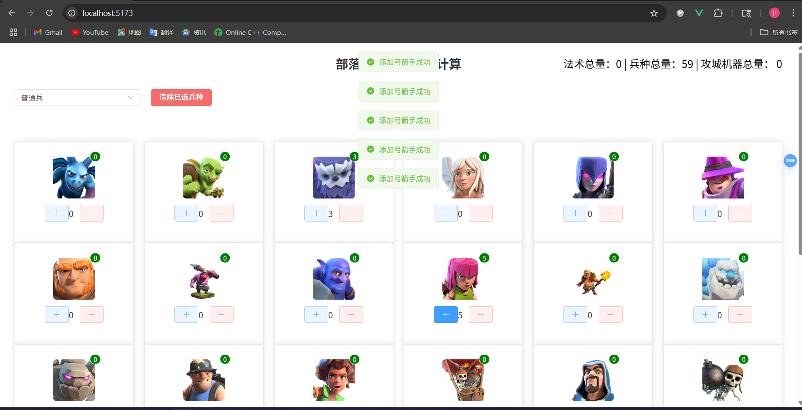

# 项目介绍
本项目主要是不需要登录部落冲突客户端或者暂停脚本就可以选兵配兵
采用antfu的eslint配置保证代码规范性
采用typescript保证代码类型安全
采用vite作为前端框架，采用pnpm作为包管理工具
采用express作为后端框架，采用mysql作为数据库
采用pinia作为状态管理工具，采用axios作为请求工具
# 主要功能
- 选兵
当兵种达到容量后，无法继续选兵，并且不能选择的兵种会被黑色覆盖，更加友好；
当某个兵种已选为零时，无法删除；
可以一键清除已经选择的兵种
翻到下面的兵种时，会出现出到顶部按钮，并且总兵种数仍会显示在右上方
# 技术栈
## 前端
- vue3
- vite
- element-plus
- pinia
- axios
## 后端
- node.js 22.11
- express
- mysql
# 启动方式
## 前端
先安装库
```
pnpm install
```
启动
```
pnpm dev
```
## 后端
先全局安装nodemon（用户更新后端不需要重启项目，不修改项目可以不安装）
```
npm install -g nodemon
```
安装包
```
npm install
```
运行截图

# 主要功能
- 选兵
- 配兵
# 文件结构

```
clash_of_clans
├─ back //后端
│  ├─ db.js // 数据库相关
│  ├─ index.js // 后端主文件
│  ├─ package-lock.json
│  ├─ package.json // 后端包文件
│  └─ sql
│     └─ index.sql // 建数据库，建表文件
├─ clash_of_clans_picker
│  ├─ .prettierrc.json
│  ├─ components.d.ts
│  ├─ env.d.ts
│  ├─ eslint.config.js //eslint配置文件
│  ├─ index.html
│  ├─ package.json
│  ├─ pnpm-lock.yaml
│  ├─ public
│  │  └─ images // 静态资源，图片
│  │     ├─ machines
│  │     │  ├─ 攻城机器-攻城战车.png
│  │     │  ├─ 攻城机器-攻城气球.png
│  │     │  ├─ 攻城机器-攻城滚木车.png
│  │     │  ├─ 攻城机器-攻城烈焰车.png
│  │     │  ├─ 攻城机器-攻城训练营.png
│  │     │  ├─ 攻城机器-攻城钻机.png
│  │     │  ├─ 攻城机器-攻城飞艇.png
│  │     │  └─ 攻城机器-部队发射器.png
│  │     ├─ magics
│  │     │  ├─ 法术-伤害药水法术.png
│  │     │  ├─ 法术-冰冻法术.png
│  │     │  ├─ 法术-回溯法术.png
│  │     │  ├─ 法术-地震法术.png
│  │     │  ├─ 法术-复苏法术.png
│  │     │  ├─ 法术-弹跳法术.png
│  │     │  ├─ 法术-急速法术.png
│  │     │  ├─ 法术-根蔓法术.png
│  │     │  ├─ 法术-狂暴法术.png
│  │     │  ├─ 法术-疗伤法术.png
│  │     │  ├─ 法术-蝙蝠法术.png
│  │     │  ├─ 法术-铁皮法术.png
│  │     │  ├─ 法术-镜像法术.png
│  │     │  ├─ 法术-隐形法术.png
│  │     │  └─ 法术-雷电法术.png
│  │     ├─ super_troops
│  │     │  ├─ 超级兵-地域飞龙.png
│  │     │  ├─ 超级兵-寒冰猎犬.png
│  │     │  ├─ 超级兵-火箭气球兵.png
│  │     │  ├─ 超级兵-超级亡灵.png
│  │     │  ├─ 超级兵-超级女巫.png
│  │     │  ├─ 超级兵-超级巨人.png
│  │     │  ├─ 超级兵-超级巨石投手.png
│  │     │  ├─ 超级兵-超级弓箭手.png
│  │     │  ├─ 超级兵-超级法师.png
│  │     │  ├─ 超级兵-超级炸弹人.png
│  │     │  ├─ 超级兵-超级瓦力基女神.png
│  │     │  ├─ 超级兵-超级矿工.png
│  │     │  ├─ 超级兵-超级野猪骑士.png
│  │     │  ├─ 超级兵-超级野蛮人.png
│  │     │  ├─ 超级兵-超级飞龙.png
│  │     │  └─ 超级兵-隐秘哥布林.png
│  │     └─ troops
│  │        ├─ 普通兵-亡灵.png
│  │        ├─ 普通兵-哥布林.png
│  │        ├─ 普通兵-大雪怪.png
│  │        ├─ 普通兵-天使.png
│  │        ├─ 普通兵-女巫.png
│  │        ├─ 普通兵-守护者学徒.png
│  │        ├─ 普通兵-巨人.png
│  │        ├─ 普通兵-巨矛投手.png
│  │        ├─ 普通兵-巨石投手.png
│  │        ├─ 普通兵-弓箭手.png
│  │        ├─ 普通兵-德鲁伊.png
│  │        ├─ 普通兵-戈仑冰人.png
│  │        ├─ 普通兵-戈仑石人.png
│  │        ├─ 普通兵-掘地矿工.png
│  │        ├─ 普通兵-根蔓骑士.png
│  │        ├─ 普通兵-气球兵.png
│  │        ├─ 普通兵-法师.png
│  │        ├─ 普通兵-炸弹人.png
│  │        ├─ 普通兵-烈焰熔炉.png
│  │        ├─ 普通兵-熔岩猎犬.png
│  │        ├─ 普通兵-瓦丽基武神.png
│  │        ├─ 普通兵-皮卡超人.png
│  │        ├─ 普通兵-英雄猎手.png
│  │        ├─ 普通兵-野猪骑士.png
│  │        ├─ 普通兵-野蛮人.png
│  │        ├─ 普通兵-雷电飞龙.png
│  │        ├─ 普通兵-雷霆泰坦.png
│  │        ├─ 普通兵-飞龙.png
│  │        ├─ 普通兵-飞龙宝宝.png
│  │        └─ 普通兵-龙骑士.png
│  ├─ README.md
│  ├─ src
│  │  ├─ api
│  │  │  └─ path.ts // 封装请求方法
│  │  ├─ App.vue
│  │  ├─ assets
│  │  │  └─ images
│  │  ├─ auto-import.d.ts // 与自动导入有关，如element-plus的自动导入
│  │  ├─ main.ts
│  │  ├─ router
│  │  │  └─ index.ts // 路由配置
│  │  ├─ stores
│  │  │  ├─ index.ts
│  │  │  └─ modules
│  │  │     ├─ singleTroop.ts // 存储每个兵种的数量
│  │  │     └─ totalTroop.ts // 存储每一类兵种的总数
│  │  ├─ utils
│  │  │  └─ request.ts // 封装axios请求
│  │  └─ views
│  │     └─ ManageView.vue // 主页面
│  ├─ tsconfig.app.json
│  ├─ tsconfig.json
│  ├─ tsconfig.node.json
│  └─ vite.config.ts
├─ image.png
└─ README.md

```